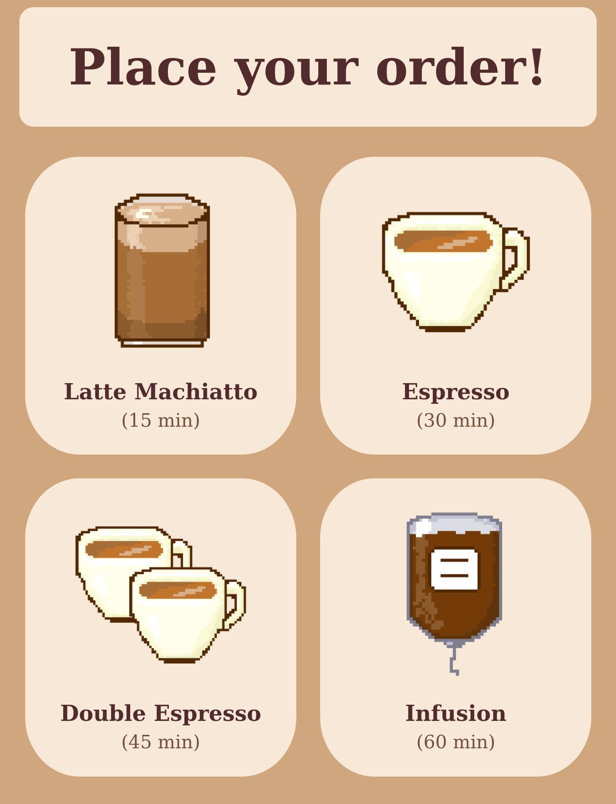
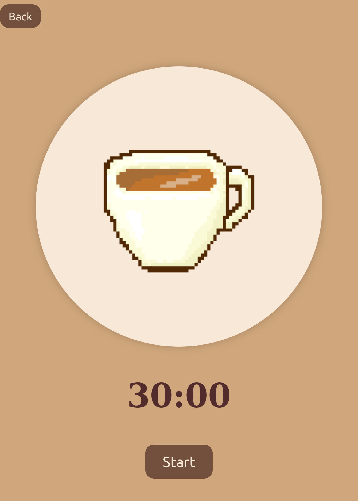
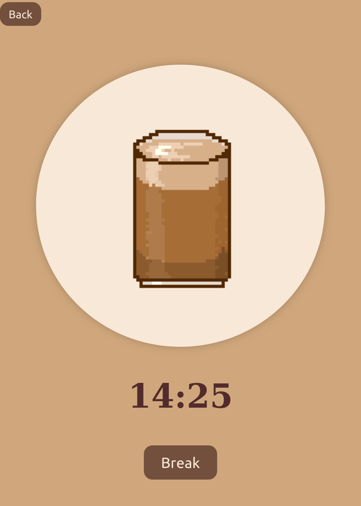

<h1>☕ Pomodoro Coffee Timer </h1> 

<h2> Overview </h2>
This is a pixelart coffee themed productivity timer.  
It let's you choose between four coffee types, each representing a different focus session length.  
Once the session is finished a bell sound notifies you that you should be take a break.

<h2> Features </h2>
<ul>
    <li>Pixel art coffee icons:</li>
        <ul>
            <li>  Latte Macchiato - 15 minutes</li>
            <li>  Espresso - 30 minutes </li>
            <li>  Double Espresso - 45 minutes </li>
            <li>  Infusion - 60 minutes </li>
        </ul>
    <li> Simple countdown interface </li>
    <li> Audio alert once time runs out </li>
</ul>

<h2>🖥️ How It Works </h2>
<ol>
    <li> On the start page, select your coffee type/session length by clicking the icon </li>
    <li>You'll be taken to the timer page showing the coffee icon and a countdown </li>
    <li>Start the countdown by clicking <strong>Start</strong> </li>
    <li>Once the time is up, a bell sound will ring </li>
    <li>Take a break and enjoy your coffee</li>
</ol>

<h2> Motivation </h2>
This project was built to create a cozy version of a simple Pomodoro Timer.

<h2>📸 Screenshots </h2>

    <figure>
        
        <figcaption>Starting page</figcaption>
    </figure>
    <figure>
        
        <figcaption>Espresso timer page</figcaption>
    </figure>
    <figure>
        
        <figcaption>Latte Macchiato timer page</figcaption>
    </figure>

<h2> License </h2>
<ul>
    <li> Pictures by pastlpixel </li>
    <li> Ringing bell - happy.wav by domrodrig -- https://freesound.org/s/116779/ -- License: Creative Commons 0 </li>
</ul>
