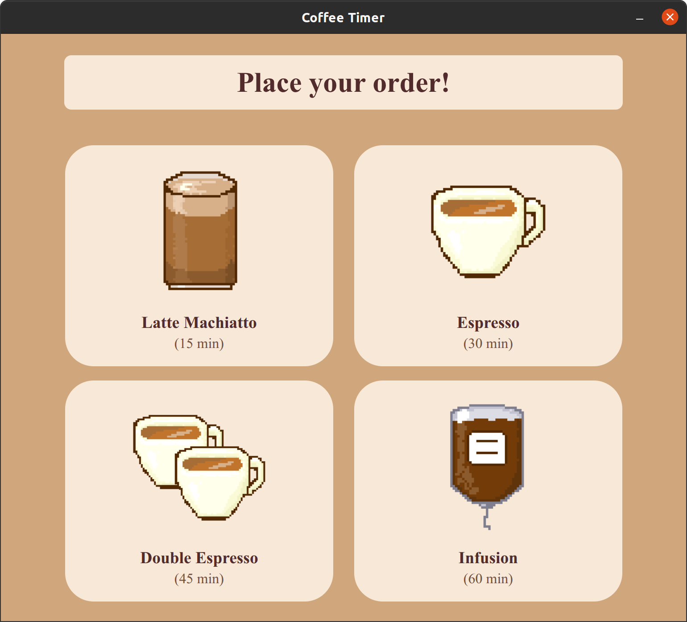
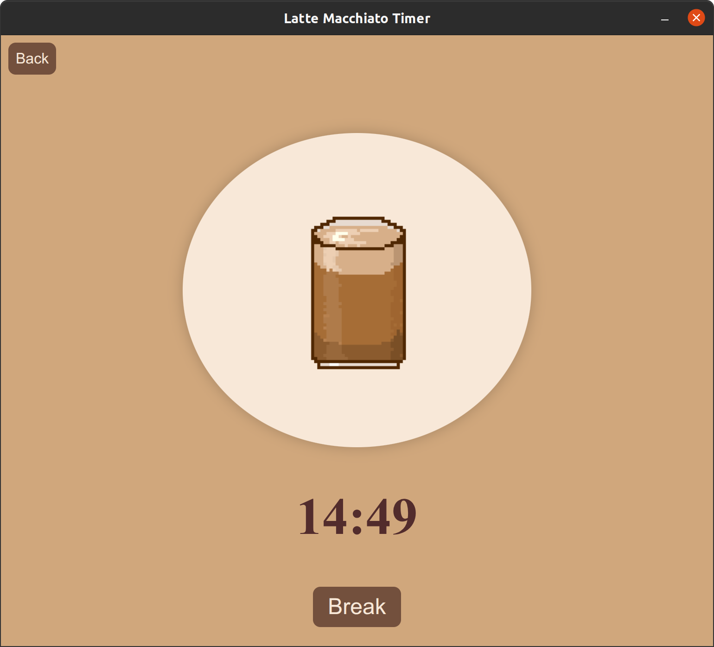

# ☕ Pomodoro Coffee Timer 
Coffee Timer is a pixelart coffee themed productivity timer.  
It let's you choose between four coffee types, each representing a different focus session length.  
Once the session is finished a bell sound notifies you that you should be take a break.

## 🛠 Features 
- Pixel art coffee icons:
    -  Latte Macchiato - 15 minutes
    -  Espresso - 30 minutes 
    -  Double Espresso - 45 minutes 
    -  Infusion - 60 minutes 
- Simple countdown interface 
- Audio alert once time runs out 

## 🖥️ How It Works 
1. On the start page, select your coffee type/session length by clicking the icon 
2. You'll be taken to the timer page showing the coffee icon and a countdown
3. Start the countdown by clicking **Start**
4. Once the time is up, a bell sound will ring 
5. Take a break and enjoy your coffee

## Motivation 
This project was built to create a cozy version of a simple Pomodoro Timer.

## 📸 Screenshots 
|||
|---|---|
||  |

## License 
- Pictures by pastlpixel 
- Ringing bell - happy.wav by domrodrig -- https://freesound.org/s/116779/ -- License: Creative Commons 0 
